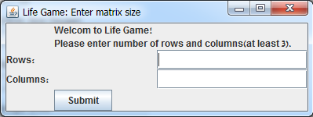
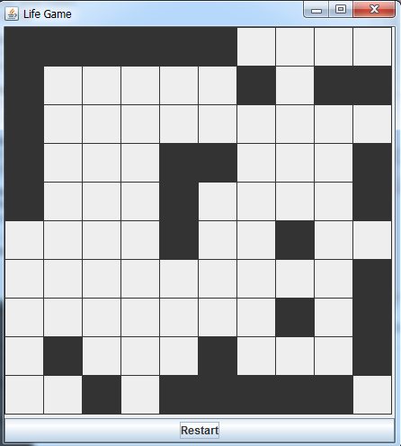

# Life Game

Concurrent version of Life game by John Conway.

Cells are died and born by these set of rules:  
* If cell is dead and have exactly 3 living neighbors – It will be live in next generation.
* If cell is alive and have 2 or 3 living neighbors it will stay alive, otherwise it will die in next generation

This program caluclate the next generation cuncurrently and display matrix represent the current generation to the user.

## Highlights:
* Java
* Java GUI
* Concurrent

## Screenshots: 
* Input screen: 
    
* In Game: 
    